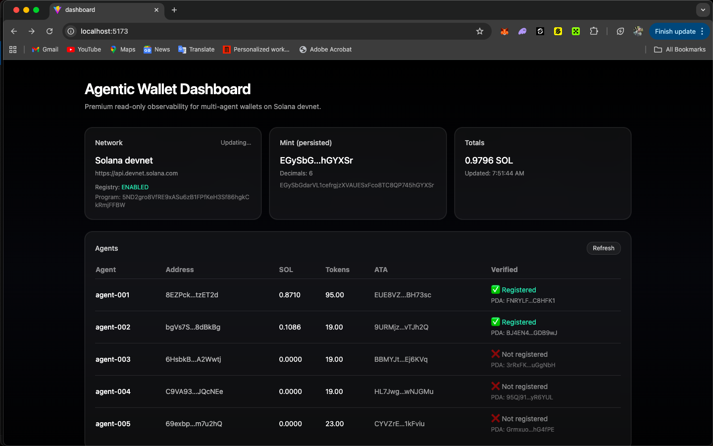

🤖 Agentic Wallets for AI Agents (Solana Devnet)

Autonomous, encrypted, multi-agent wallet infrastructure for Solana AI
agents. Built for the Superteam Nigeria DeFi Developer Challenge.

Last Updated: 2026-02-19 20:43 UTC

  ----------------------
  🚀 Executive Summary
  ----------------------

This project is a fully working agentic wallet framework that enables AI
agents to become autonomous economic actors on Solana Devnet.

Unlike a basic wallet demo, this system implements:

• Programmatic wallet generation per agent • AES‑256‑GCM encrypted
keystore storage • scrypt-based key derivation • Automatic transaction
signing (Versioned Transactions) • SOL transfers • SPL token minting and
transfers • Persistent state management • Multi-agent orchestration
harness • Spend guardrails (transfer caps) • AI-native HTTP 402 payment
engine (x402-style) • Premium React observability dashboard

The result is a modular, extensible infrastructure layer for AI-native
finance.

  ------------------------------
  🏗 Full Architecture Overview
  ------------------------------

                ┌──────────────────────────────┐
                │          CLI Layer           │
                │  (src/cli.ts - Commander)    │
                └──────────────┬───────────────┘
                               │
        ┌──────────────────────┼────────────────────────┐
        │                      │                        │

┌────────────────┐ ┌────────────────┐ ┌────────────────┐ │ Agent Brain │
│ Wallet Manager │ │ Tx Service │ │ (Policy Logic) │ │ (Keys + Sign) │ │
(Build/Send) │ └────────┬───────┘ └────────┬───────┘ └────────┬───────┘
│ │ │ └──────────────┬─────┴───────────────┬─────────┘ │ │
┌────────────────┐ ┌────────────────┐ │ SPL Token Svc │ │ State Store │
│ (Protocol) │ │ (Persistence) │ └────────────────┘ └────────────────┘

Add-ons: • Guardrails Layer • x402 Payment Engine • Dashboard API •
React Dashboard UI

Design Principles: - Strict separation of policy, signing, and
execution - Simulation-first transaction flow - Persistent yet encrypted
local storage - Horizontal scalability for N agents

  ----------------------------
  🔐 Wallet & Key Management
  ----------------------------

Each agent: • Generates a unique Solana keypair programmatically •
Encrypts private key using AES‑256‑GCM • Uses scrypt for key derivation
• Stores encrypted keystore locally • Loads key only when signing is
required

Why this matters: AI agents must control funds autonomously without
exposing private keys. This implementation demonstrates secure local
custody suitable for sandboxed agents.

Security Boundaries: - No plaintext private keys stored - Encryption
passphrase stored in environment - Dashboard is read-only (no signing
exposed)

  -----------------------------
  💸 Transaction Capabilities
  -----------------------------

SOL Transfers: • Versioned transactions (v0) • Pre-flight simulation •
Automatic signing • Confirmation + explorer link output

SPL Token Operations: • Create mint • Create ATA per agent • Mint tokens
• Transfer tokens • Read token balances • Reuse persistent mint across
runs

All interactions occur live on Solana Devnet.

----------------------------------------------------
  🪐 DeFi Trade Execution — Jupiter Swap Integration
  ----------------------------------------------------

To satisfy the “autonomous trade execution” requirement, the system
integrates Jupiter’s Swap API to demonstrate a real DeFi trading
pipeline.

The agent can:

• Request a live swap quote (SOL → USDC) • Receive optimal route data •
Build a serialized swap transaction • Sign the swap transaction
autonomously • Simulate execution before broadcasting

Run Trade (Safe Dry-Run Mode):

npx ts-node src/addons/jupiter/jupiterSwap.ts –agent agent-001 –sol 0.02
–slippageBps 100 –cluster mainnet-beta

Example Output:

1)  Getting quote… ✅ Quote OK inAmount (lamports): 20000000 outAmount
    (raw USDC): 1645432 route hops: 2

2)  Building swap transaction… ✅ Received serialized swap transaction

3)  Signing + simulating… ✅ Simulation complete

By default the swap runs in dry-run mode (no real funds used).

To execute a real mainnet trade (optional):

npx ts-node src/addons/jupiter/jupiterSwap.ts --agent agent-001 --sol 0.02 --slippageBps 100 --cluster mainnet-beta --execute

This proves: • Live DeFi route discovery • Real DEX liquidity routing •
Autonomous transaction signing • Trade simulation before execution

  -----------------------------------
  🧠 Agent Brain (Autonomous Logic)
  -----------------------------------

The Agent Brain implements rule-based economic behavior:

Example Policy: • Ensure agent-001 maintains >= 50 tokens • Ensure
agent-002 maintains >= 10 tokens • Mint when below threshold • Transfer
when required

This demonstrates: • Autonomous decision-making • Conditional execution
• Policy enforcement • Persistent state awareness

The multi-agent harness expands this into: • Configurable agent count •
Configurable rounds • Deterministic seeding • Cyclical token flows

This simulates economic micro-ecosystems between agents.

  ------------------------------
  🛡 Guardrails (Risk Controls)
  ------------------------------

To ensure safe autonomy:

• SOL transfer caps enforced • Simulation before send • Policy-based
mint thresholds • Error-safe execution paths • Separation between
signing and policy

Production Recommendations: • On-chain guardrail program • MPC wallet
integration • Allowlisted program interactions • Rate limiting

  ------------------------------------------
  🌐 AI-Native Payment Engine (x402-style)
  ------------------------------------------

Implements an HTTP 402 Payment Required workflow:

1.  Agent requests protected resource
2.  Server responds 402 with required SOL amount
3.  Agent pays on-chain automatically
4.  Agent retries request with transaction signature
5.  Server verifies on-chain payment
6.  Resource returned

This demonstrates: • Machine-to-machine economic interaction •
Autonomous API monetization • On-chain proof verification • AI-native
micropayments

This is foundational for AI-to-AI service markets.

  --------------------------------------------
  📊 Premium Dashboard (Observability Layer)
  --------------------------------------------

React + Vite + Tailwind UI

Features: • Live polling • Mint display • Agent balance table • Public
addresses + ATA display • Total SOL aggregation • Flicker-free refresh
(stale-while-revalidate) • Warning handling for RPC issues

Security: • Read-only API • No private keys exposed • Local-first
backend

Purpose: Provide judges and developers real-time visibility into
autonomous agent activity.

  ----------------------------
  ⚡ Demo Flow (Recommended)
  ----------------------------

1.  Run SOL transfer npm run dev – step3 –amount 0.05

2.  Run SPL mint + transfer npm run dev – step4

3.  Run agent brain npm run dev – step5

4.  Run multi-agent harness npm run dev – step6 –agents 5 –rounds 3
    –seed 25

5.  Run AI payment demo npm run x402:server npm run x402:client –
    –server http://localhost:8787 –agent agent-001

6.  Run dashboard npm run dash:api cd dashboard npm run dev

  --------------------------------
  📈 Scalability & Extensibility
  --------------------------------

Horizontal scalability: • Independent wallet per agent • Independent
token account per agent • Stateless CLI • Modular services

Extensible areas: • Jupiter swaps integration • Liquidity provisioning
agents • Autonomous yield strategies • On-chain policy contracts •
AI-agent marketplace

  --------------------
  ✅ Judge Checklist
  --------------------

[x] Programmatic wallet creation [x] Automatic signing [x] SOL support
[x] SPL token support [x] Protocol interaction [x] Multi-agent
simulation [x] Encrypted key management [x] AI-native payment model [x]
Observability dashboard [x] Devnet working prototype

  

## 📊 Observability Dashboard

The system includes a premium read-only dashboard for monitoring agent activity in real time.

Features:
- Live SOL balance aggregation
- SPL token balances per agent
- Persisted mint display
- ATA mapping visibility
- RPC health monitoring

The dashboard is intentionally read-only to preserve key security boundaries.

-------------------
  🏁 Final Thoughts
  -------------------

This submission demonstrates that AI agents on Solana can:

• Hold assets • Make decisions • Enforce rules • Execute DeFi trades •
Transact autonomously • Pay for services • Operate safely in sandboxed
environments

It is an extensible, modular agent wallet framework designed for future
expansion into production-grade AI finance infrastructure.
